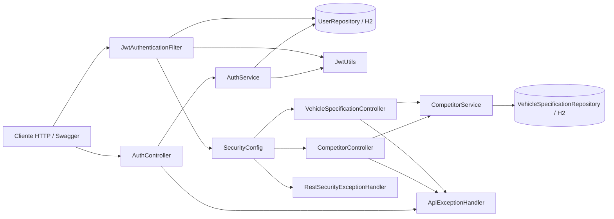
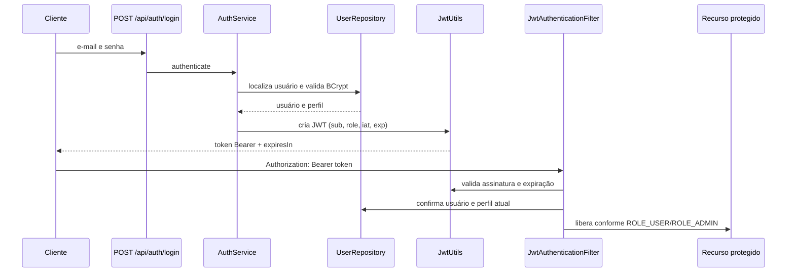

# Ford Competitor Intelligence API — Sprint 3

## Integrantes

- Gabriel Guilherme Leste — RM 558638
- Fernando Carlos Colque Huaranca — RM 558095
- Gabriel Lacerda Araújo — RM 558307
- Julia Carolina Ferreira Silva — RM 558896

API REST para consultar e cadastrar especificações de veículos concorrentes da Ford. A entrega implementa autenticação JWT, autorização por perfil, recursos REST, documentação OpenAPI e testes automatizados.

## Tecnologias

- Java 17+ (projeto compilado com `--release 17`)
- Spring Boot 3.2.3, Spring Security e Spring Data JPA
- H2 em memória
- JJWT (HS256)
- SpringDoc OpenAPI / Swagger UI
- JUnit 5 e MockMvc

## Arquitetura da solução



| Camada | Responsabilidade |
|---|---|
| `controller` | Contratos HTTP, validação de entrada e códigos de resposta. |
| `service` | Autenticação, regras de negócio e orquestração de consultas/cadastros. |
| `repository` | Acesso aos dados com JPA. |
| `model` | Entidades persistidas e papéis de usuário. |
| `dto` | Contratos de entrada, saída, token e erro; não expõem entidades. |
| `config` | Filtro JWT, política de segurança, OpenAPI e carga de dados de demonstração. |
| `exception` | Exceções de domínio e resposta de erro consistente. |

## Fluxo de autenticação e autorização



O token é assinado com HS256 e contém somente `sub` (e-mail), `role`, `iat` e `exp`. A expiração padrão é de **1 hora** (`3600` segundos), retornada em `expiresIn`. O filtro também confirma o usuário e o perfil atuais no banco, de modo que um token antigo não conserva uma permissão alterada.

| Perfil | Permissões |
|---|---|
| `ROLE_USER` | Consultar especificações protegidas. |
| `ROLE_ADMIN` | Consultar e cadastrar especificações. |

## Endpoints

| Método | Rota | Acesso | Sucesso | Descrição |
|---|---|---|---|---|
| `POST` | `/api/auth/login` | Público | `200` | Autentica e retorna JWT. |
| `GET` | `/api/v1/competitors/{brand}/{model}/{version}/specifications?attributes=Motor&attributes=Preco` | USER ou ADMIN | `200` | Consulta orientada ao recurso veículo. |
| `POST` | `/api/v1/vehicle-specifications` | ADMIN | `201` + `Location` | Cadastra uma especificação. |
| `POST` | `/api/v1/competitors/query` | USER ou ADMIN | `200` | Rota legada, preservada por compatibilidade; prefira o `GET` acima. |

Os status codes também expressam os erros: `400` (entrada inválida), `401` (JWT ausente, inválido ou expirado), `403` (perfil insuficiente) e `409` (especificação duplicada).

### Login

```http
POST /api/auth/login
Content-Type: application/json

{
  "email": "user@ford.com",
  "password": "user123"
}
```

```json
{
  "token": "eyJhbGciOiJIUzI1NiJ9...",
  "type": "Bearer",
  "expiresIn": 3600
}
```

Use o valor retornado em `Authorization: Bearer <token>` nas rotas protegidas.

### Consulta REST

```http
GET /api/v1/competitors/Ford/Ranger/Raptor/specifications?attributes=Motor&attributes=Preco
Authorization: Bearer <token>
```

```json
{
  "brand": "Ford",
  "model": "Ranger",
  "version": "Raptor",
  "specifications": [
    { "attribute": "Motor", "value": "3.0 V6 Bi-Turbo Gasoline", "available": true },
    { "attribute": "Preco", "value": "Não disponível", "available": false }
  ]
}
```

### Cadastro administrativo

```http
POST /api/v1/vehicle-specifications
Authorization: Bearer <token-admin>
Content-Type: application/json

{
  "brand": "Toyota",
  "model": "Hilux",
  "version": "SRX",
  "attribute": "Motor",
  "value": "2.8 Turbo Diesel"
}
```

## Respostas de erro

Todos os erros da API seguem o mesmo contrato:

```json
{
  "timestamp": "2026-09-27T18:00:00Z",
  "status": 401,
  "error": "Unauthorized",
  "code": "unauthorized",
  "message": "É necessário informar um token JWT válido",
  "path": "/api/v1/competitors/Ford/Ranger/Raptor/specifications"
}
```

Em erros de validação, `fieldErrors` identifica cada campo inválido.

## Executar localmente

Pré-requisitos: JDK 17+ e Maven 3.8+.

```bash
mvn spring-boot:run
```

A API inicia em `http://localhost:8080`.

Para produção, não use o segredo de desenvolvimento. Configure as variáveis abaixo antes de iniciar:

```powershell
$env:JWT_SECRET = "uma-chave-secreta-com-pelo-menos-32-caracteres"
$env:JWT_EXPIRATION_MS = "3600000"
mvn spring-boot:run
```

Usuários de demonstração carregados no H2:

| E-mail | Senha | Perfil |
|---|---|---|
| `user@ford.com` | `user123` | `ROLE_USER` |
| `admin@ford.com` | `admin123` | `ROLE_ADMIN` |

O console H2 (`/h2-console`) é disponibilizado apenas para demonstração local. JDBC URL: `jdbc:h2:mem:forddb`; usuário: `sa`; senha em branco.

## OpenAPI / Swagger

- Swagger UI: `http://localhost:8080/swagger-ui/index.html`
- Documento OpenAPI: `http://localhost:8080/v3/api-docs`

No Swagger, execute o login, copie apenas o valor de `token` e use **Authorize**. A documentação declara o esquema Bearer, os perfis, os status e o formato de erro.

## Testes automatizados e evidência

Execute:

```bash
mvn test
```

A última execução desta entrega produziu:

```text
Tests run: 9, Failures: 0, Errors: 0, Skipped: 0
```

Os cenários cobrem login, expiração, token malformado, acesso sem JWT, consulta autorizada, validação, autorização de `USER` e cadastro de `ADMIN`. Após uma execução, o relatório detalhado fica em `target/surefire-reports/com.ford.competitor.CompetitorApiTests.txt`.


